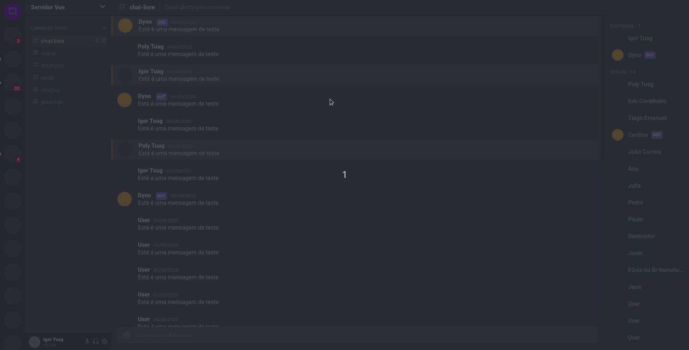

<h1 align="center">
<p>

</p>
DISCORD UI CLONE
</h1>

<p align="center">Discord Clone UI is just a clone of the Discord interface for educational purposes and study of interface creation tools. </p>

<p align="center">
  <a href="https://opensource.org/licenses/MIT">
    
  </a>
</p>

[//]: #

<hr />

## Demo

<div>
  <p align="center">
  
   </p>
</div>

<hr />

## Tecnologias

> A Vue.js project

[//]: # 'Add the features of your project here:'

This app features all the latest tools and practices in web development!

- **Vue Js** — A JavaScript Framework for building user interfaces
- **SASS** - Sass is a stylesheet language that’s compiled to CSS.
- **CSS GRID** - Layout Module offers a grid-based layout system, with rows and columns, making it easier to design web pages without having to use floats and positioning.

## Build Setup

```bash
# install dependencies
yarn install

# serve with hot reload at localhost:8080
yarn dev

# build for production with minification
yarn build
```

For detailed explanation on how things work, consult the [docs for vue-loader](http://vuejs.github.io/vue-loader).

### Customize configuration

See [Configuration Reference](https://cli.vuejs.org/config/).

## Class on Youtube

[VueJs - Clone da Interface do Discord com CSS Grid - UI Clone | Maikel Neris](https://www.youtube.com/watch?v=E0RwkG3BKvo)

[ReactJs - Recriando a Interface do Discord - UI Clone | Rocketseat](https://www.youtube.com/watch?v=x4FdZd2-_uU&t=295s)

Made with ❤️ by Igor Tuag 👋🏽 [Keep in touch!](https://www.linkedin.com/in/igortuag/)
